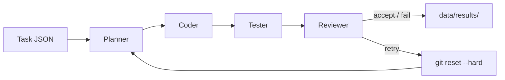

# Code Repair Agent

`code_repair_agent` is a local Python CLI project for running a small code-repair workflow against a repository task.

The core loop is:

`issue -> patch -> test -> review`

The project uses a single-model, multi-agent workflow with four roles:

- `Planner`: turns the issue into a short repair plan
- `Coder`: searches the repo, edits code, and explains the repair
- `Tester`: runs the local test command through the Python tool layer and summarizes the result
- `Reviewer`: decides whether the current state should be `accept`, `retry`, or `fail`

## System Architecture



Key modules:

- `app/main.py`: CLI entrypoint
- `app/runner.py`: workflow orchestration, retry loop, rollback, result persistence
- `app/agents/planner.py`: planner stage
- `app/agents/coder.py`: coder stage
- `app/agents/tester.py`: tester stage
- `app/agents/reviewer.py`: reviewer stage
- `app/tools/`: repo, test, and git helpers
- `app/eval/benchmark.py`: serial benchmark runner

## Quick Start

Recommended environment:

- Python 3.12 for OpenHands-backed planner/coder/reviewer stages
- a configured `.env` file for model access when using `plan_and_code`

Install `uv`:

```bash
curl -LsSf https://astral.sh/uv/install.sh | sh
```

Create the OpenHands runtime environment with Python 3.12:

```bash
uv venv --python 3.12 .venv
source .venv/bin/activate
uv pip install -r requirements.txt
```

Create your local environment file:

```bash
cp .env.example .env
```

Then edit `.env` and fill in the model-related settings you actually use, such as:

- `LLM_API_KEY`
- `LLM_MODEL`
- `LLM_BASE_URL`
- `OPENHANDS_API_KEY` and `OPENHANDS_BASE_URL` when needed in your setup

Optional sanity check:

```bash
.venv/bin/python -m app.main show-config
```

One command that can run immediately without model configuration:

```bash
.venv/bin/python -m app.main run --task-file data/tasks/buggy_high.json --run-tests-only
```

This command uses the local tester path only and prints a compact result summary for the sample repo task.

Full workflow with planner, coder, tester, reviewer, retry, and rollback:

```bash
.venv/bin/python -m app.main run --task-file data/tasks/buggy_low.json --mode plan_and_code
```

Useful CLI commands:

```bash
.venv/bin/python -m app.main show-config
.venv/bin/python -m app.main run --task-file data/tasks/buggy_low.json --mode demo
```

GitHub-ready repository files included in this project:

- `.gitignore`
- `LICENSE` (MIT)
- `.github/ISSUE_TEMPLATE/bug_report.md`
- `.github/PULL_REQUEST_TEMPLATE.md`

Main CLI commands:

- `show-config`: print resolved project paths and runtime config
- `run`: run one task in `demo`, `tests`, `agent`, `baseline`, or `plan_and_code` mode
- `benchmark`: run multiple tasks serially and write a summary report

Result persistence:

- Per-task results go to `data/results/{task_id}/`
- Benchmark summary goes to `data/results/benchmark_summary.md`

## Benchmark Results

Tested benchmark snapshot:

| metric | value |
| --- | --- |
| total_tasks | 8 |
| success_count | 6 |
| success_rate | 75.00% |
| avg_retries | 0.25 |
| test_pass_rate | 87.50% |

This is a local benchmark result for the current project state, intended as an engineering snapshot rather than a fixed guarantee.

## Task Format

Each task is a JSON file under `data/tasks/`.

Example:

```json
{
  "task_id": "repair-high-003",
  "repo_path": "repos/demo_repo",
  "issue_title": "Fix mutable default log state and thread-safe counter behavior",
  "issue_description": "In buggy_high.py, add_to_log should not share state across separate calls, and increment_counter should produce the expected final count when used from multiple threads.",
  "expected_test_command": "python3 buggy_high.py"
}
```

Fields:

- `task_id`: unique identifier for result storage
- `repo_path`: repository path, relative to the project root or absolute
- `issue_title`: short issue summary
- `issue_description`: detailed repair target
- `expected_test_command`: optional explicit test command; if omitted, the tester falls back to the repo-specific default behavior

## Benchmark

The project includes a serial benchmark runner for internal evaluation. The current tested result snapshot is shown in the Benchmark Results section above.

It records:

- `total_tasks`
- `success_count`
- `success_rate`
- `avg_retries`
- `test_pass_rate`

Current behavior:

- serial execution only
- failed tasks are still included in the final report
- report format is markdown
- each task still writes its own normal result directory while benchmark is running
- benchmark summary artifacts are written under `data/results/`

## Current Limits

- This is a local CLI project only. There is no frontend, database, or deployment layer.
- Planner, coder, and reviewer stages rely on OpenHands and an external model endpoint when running the full `plan_and_code` workflow.
- OpenHands-backed stages require Python 3.12+. Running the CLI with an older interpreter can make tests pass while agent stages still fail.
- Retry and rollback are bounded and simple: reviewer-driven retries are capped, and rollback uses `git reset --hard` inside the target repo.
- Result diff capture is currently less precise for untracked files. `changed_files` can reflect working-tree state rather than only the files edited in the current attempt.
- Benchmark runs are not isolated per task. Tasks share the same local repository state unless you reset or prepare the repo between runs.

## License

This repository is provided under the MIT License. See `LICENSE`.
